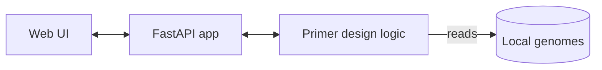

# hookSNiP 🧬  
_A local web app for allele-specific primer design for hookworm_

<p align="center">
  <a href="#license"></a>
  
  
  
</p>

> **What is it?** `hookSNiP` is an app that runs locally and helps you design allele-specific primers against hookworm genomes.

<p align="center">
  <!-- Replace with a real screenshot or GIF -->
  
</p>

---

## ✨ Features
- Local processing — with your own genomes (FASTA).
- Point the app at your genomes with a single env var: `HOOKSNIP_GENOMES_DIR`.
- Lightweight web UI served from your machine.
- No cloud dependencies required.

---

## 🚀 Quickstart

### 1) Create a virtualenv & install
```bash
python3 -m venv .venv && . .venv/bin/activate
pip3 install -r requirements.txt
```

### 2) Fetch example genomes (optional)
```bash
mkdir -p data/genomes && curl -L --fail --retry 3 -o data/genomes/ac_prjna72585.fa.gz "https://ftp.ebi.ac.uk/pub/databases/wormbase/parasite/releases/WBPS19/species/ancylostoma_caninum/PRJNA72585/ancylostoma_caninum.PRJNA72585.WBPS19.genomic.fa.gz" && curl -L --fail --retry 3 -o data/genomes/acey_prjna72583.fa.gz "https://ftp.ebi.ac.uk/pub/databases/wormbase/parasite/releases/WBPS19/species/ancylostoma_ceylanicum/PRJNA72583/ancylostoma_ceylanicum.PRJNA72583.WBPS19.genomic.fa.gz" && curl -L --fail --retry 3 -o data/genomes/acey_prjna231479.fa.gz "https://ftp.ebi.ac.uk/pub/databases/wormbase/parasite/releases/WBPS19/species/ancylostoma_ceylanicum/PRJNA231479/ancylostoma_ceylanicum.PRJNA231479.WBPS19.genomic.fa.gz" && gunzip -f data/genomes/*.fa.gz
```

### 3) (Optional) Use a custom genomes folder
- **macOS/Linux**
  ```bash
  export HOOKSNIP_GENOMES_DIR=/absolute/path/to/genomes
  ```
- **Windows (PowerShell)**
  ```powershell
  $env:HOOKSNIP_GENOMES_DIR="C:\absolute\path\to\genomes"
  ```

**Accepted formats**
- `.fa`, `.fasta`, `.fna` (plain text)
- `.fa.gz` (the server will decompress to a temp workspace)

### 4) Run the app
```bash
uvicorn server.main:app --reload --port 8000
# then open http://localhost:8000/
```

---

## 🧑‍💻 Usage

### Web UI
Open `http://localhost:8000/`, select a genome, fill in your SNP/target details, and generate primers.  
_Pro tip:_ keep your genomes organized under `data/genomes/` (or your custom `HOOKSNIP_GENOMES_DIR`).

### API (optional)
FastAPI exposes interactive docs automatically:
- Swagger UI: `http://localhost:8000/docs`
- ReDoc: `http://localhost:8000/redoc`

---

## 🗂️ Project structure
```
hookSNiP/
├─ public/           # static assets (add screenshots/GIFs here)
├─ sample_input/     # example inputs (for demo/testing)
├─ server/           # FastAPI app (e.g., server.main:app)
├─ requirements.txt  # Python dependencies
└─ README.md
```

---

## 🧭 How it works (at a glance)



---

## 🤝 Contributing
Issues and PRs are welcome! A good first PR is adding a repo screenshot or a short demo GIF under `public/` and linking it above.

Suggested pre-commit checks:
```bash
pip install ruff black
ruff check .
black .
```

---

## 📄 License
MIT © Contributors. See [LICENSE](./LICENSE) for details.

---

## 📦 Source files (embedded)
<details>
<summary><code>index.html</code></summary>

```html
<!doctype html>
<html lang="en">
<head>
  <meta charset="utf-8" />
  <title>hookSNiP</title>
  <meta name="viewport" content="width=device-width,initial-scale=1" />
  <style>
    :root { --fg:#111; --muted:#666; --accent:#1f6feb; --bad:#d73a49; --bg:#fafbfc; }
    body { font: 14px/1.45 system-ui, -apple-system, Segoe UI, Roboto, Arial, sans-serif; color:var(--fg); margin:0; background:#fff; }
    header { padding:16px 20px; background:var(--bg); border-bottom:1px solid #e5e7eb; }
    h1 { margin:0; font-size:18px; }
    main { padding:18px 20px; max-width:1100px; }
    fieldset { border:1px solid #e5e7eb; border-radius:10px; padding:14px; margin:0 0 16px; }
    legend { color:#333; font-weight:600; padding:0 6px; }
    label { display:block; margin:8px 0 6px; }
    .row { display:grid; grid-template-columns: 1fr 1fr; gap:14px; }
    .controls { display:grid; grid-template-columns: repeat(3, minmax(160px, 1fr)); gap:12px; }
    input[type="number"]{ width:100%; }
    input[type="file"], select { width:100%; }
    .help { color:var(--muted); font-size:12px; }
    button.primary { background:#111; color:#fff; border:0; border-radius:8px; padding:10px 14px; cursor:pointer; }
    button.primary:disabled { opacity:.5; cursor:not-allowed; }
    .hidden{ display:none !important; }
    #runStatus { margin-left:10px; color:#222; }
    progress { width:220px; vertical-align: middle; }
    table { width:100%; border-collapse: collapse; margin-top:12px; }
    th, td { padding:8px 10px; border-bottom:1px solid #eee; text-align:left; }
    thead th { background:#f6f8fa; position:sticky; top:0; }
    code { background:#f6f8fa; padding:2px 6px; border-radius:4px; }
    .mm { color: var(--accent); font-weight:600; }
    .alt { color: var(--bad); font-weight:700; }
    .legend { margin:8px 0 0; color:#333; font-size:12px; }
    .download { margin-top:14px; }
  </style>
</head>
<body>

  <header>  
    <h1>hookSNiP: allele-specific primer design for hookworm</h1>
  </header>
  <main>
    <fieldset>
      <legend>Reference genome</legend>
      <div class="row">
        <div>
          <label><input type="radio" name="srcmode" value="built-in" checked /> Use built-in FASTA</label>
          <select id="genomeSelect">
            <option value="ac_prjna72585.fa">Ancylostoma caninum PRJNA72585 (WBPS19)</option>
            <option value="acey_prjna231479.fa">A. ceylanicum PRJNA231479 (WBPS19)</option>
            <option value="acey_prjna72583.fa">A. ceylanicum PRJNA72583 (WBPS19)</option>
          </select>
          <div class="help">Built-ins served as <code>genomes/*.fa</code> (plain text).</div>
        </div>
        <div>
          <label><input type="radio" name="srcmode" value="custom" /> Use custom FASTA (.fa)</label>
          <input id="customGenome" type="file" accept=".fa,.fasta,.fna" />
          <div class="help">No zip/gz; plain <code>.fa</code> only.</div>
        </div>
      </div>
    </fieldset>

    <fieldset>
      <legend>Annotations (GFF/GFF3)</legend>
      <label for="gffFile">Upload GFF/GFF3 (required)</label>
      <input id="gffFile" type="file" accept=".gff,.gff3" />
      <div class="help">Used to infer gene strand.</div>
    </fieldset>

    <fieldset>
      <legend>Variants (VCF)</legend>
      <label for="vcfFile">Upload VCF (.vcf, SNVs)</label>
      <input id="vcfFile" type="file" accept=".vcf" />
    </fieldset>

    <fieldset>
      <legend>Parameters</legend>
      <div class="controls">
        <label>Flank (bp)
          <input id="flank" type="number" min="100" max="1000" step="10" value="300" />
        </label>
        <label>Top per allele
          <input id="topPerAllele" type="number" min="1" max="5" value="1" />
        </label>
        <label><input id="insertMismatch" type="checkbox" /> Induce −2 mismatch in LEFT</label>
      </div>
      <div class="help">Tm target 60 °C ±4 °C; length 18–25 nt; GC 35–65%; amplicon 120–250 bp; homopolymer ≤5.</div>
    </fieldset>

    <div>
      <button id="runBtn" class="primary">Check VCF &amp; Design Primers</button>
      <progress id="runProgress" max="100" value="0" hidden></progress>
      <span id="runStatus">Idle.</span>
    </div>

    <div id="results"></div>
    <div id="downloadBox" class="download hidden">
      <button id="downloadHtmlBtn" class="primary">Download primers.html</button>
    </div>
  </main>
  <script src="app.js"></script>
</body>
</html>
```

</details>
<details>
<summary><code>app.js</code></summary>

```javascript

(function(){
  "use strict";
  const $  = (s) => document.querySelector(s);
  const $$ = (s) => document.querySelectorAll(s);

  function wireUI(){
    const syncGenome = () => {
      const mode = document.querySelector("input[name='srcmode']:checked").value;
      $("#genomeSelect").disabled = (mode !== "built-in");
      $("#customGenome").disabled = (mode !== "custom");
    };
    $$("input[name='srcmode']").forEach(r => r.addEventListener("change", syncGenome));
    syncGenome();
    $("#runBtn").addEventListener("click", runDesign);
  }

  async function runDesign(){
    $("#results").innerHTML = "";
    $("#downloadBox").classList.add("hidden");
    const status = $("#runStatus"); const prog = $("#runProgress");
    prog.hidden = false; prog.value = 0; status.textContent = "Uploading files...";

    try{
      const mode = document.querySelector("input[name='srcmode']:checked").value;
      const flank = Math.max(50, parseInt($("#flank").value,10) || 300);
      const top = Math.max(1, parseInt($("#topPerAllele").value,10) || 1);
      const mism = $("#insertMismatch").checked;

      const fd = new FormData();
      fd.append("srcmode", mode);
      fd.append("flank", String(flank));
      fd.append("top_per_allele", String(top));
      fd.append("insert_mismatch", String(mism));

      if (mode === "built-in") {
        const name = $("#genomeSelect").value;
        fd.append("genome_name", name);
      } else {
        const gf = $("#customGenome").files[0];
        if (!gf) throw new Error("Please choose a custom FASTA (.fa/.fasta/.fna or .fa.gz).");
        fd.append("genome", gf, gf.name);
      }
      const gff = $("#gffFile").files[0];
      if (!gff) throw new Error("Please upload a GFF/GFF3 file.");
      fd.append("gff3", gff, gff.name);

      const vcf = $("#vcfFile").files[0];
      if (!vcf) throw new Error("Please upload a VCF file.");
      fd.append("vcf", vcf, vcf.name);

      status.textContent = "Server is analyzing files...";
      const resp = await fetch("/api/run", { method: "POST", body: fd });
      if (!resp.ok) {
        const t = await resp.text();
        throw new Error("Server error: " + resp.status + " " + t);
      }
      const out = await resp.json();
      if (!out.ok) throw new Error(out.error || "Unknown error");

      $("#results").innerHTML = out.table_html || "(no table)";
      const blob = new Blob([out.primers_html || ""], { type: "text/html" });
      const url = URL.createObjectURL(blob);
      $("#downloadHtmlBtn").onclick = () => {
        const a=document.createElement("a");
        a.href = url; a.download = "primers.html"; a.click();
      };
      $("#downloadBox").classList.remove("hidden");
      status.textContent = "Done.";
    } catch (e){
      console.error(e);
      status.textContent = "Error: " + (e && e.message ? e.message : e);
    } finally {
      prog.hidden = true;
    }
  }

  document.addEventListener("DOMContentLoaded", wireUI);
})();

```

</details>
<details>
<summary><code>main.py</code></summary>

```python

import os, tempfile, shutil, gzip, io, json
from pathlib import Path
from fastapi import FastAPI, UploadFile, File, Form, HTTPException
from fastapi.responses import JSONResponse
from fastapi.middleware.cors import CORSMiddleware
from fastapi.staticfiles import StaticFiles

from . import py_core  # run_pipeline is defined there

app = FastAPI(title="HookSnip Server")

app.add_middleware(
    CORSMiddleware,
    allow_origins=["*"],
    allow_credentials=True,
    allow_methods=["*"],
    allow_headers=["*"],
)


SERVER_GENOMES_DIR = Path(os.environ.get("HOOKSNIP_GENOMES_DIR", str(Path(__file__).resolve().parent.parent / "data" / "genomes")))

def _save_upload(dst: Path, up: UploadFile):
    with dst.open("wb") as f:
        while True:
            chunk = up.file.read(1024 * 1024)
            if not chunk:
                break
            f.write(chunk)

def _ensure_plain_fasta(src_path: Path, dst_path: Path):
    if src_path.suffix.lower() == ".gz":
        with gzip.open(src_path, "rb") as gz, dst_path.open("wb") as out:
            shutil.copyfileobj(gz, out)
    else:
        shutil.copyfile(src_path, dst_path)

@app.post("/api/run")
async def run(
    srcmode: str = Form(...),
    genome_name: str = Form(None),
    flank: int = Form(300),
    top_per_allele: int = Form(1),
    insert_mismatch: bool = Form(False),
    genome: UploadFile = File(None),
    gff3: UploadFile = File(...),
    vcf: UploadFile = File(...),
):
    work = Path(tempfile.mkdtemp(prefix="hooksnip_"))
    out_dir = work / "out"
    out_dir.mkdir(parents=True, exist_ok=True)
    os.environ["OUTDIR"] = str(out_dir)
    py_core.OUTDIR = str(out_dir)
    out_dir.mkdir(parents=True, exist_ok=True)


    try:
        genome_path = work / "genome.fa"
        gff_path = work / "anno.gff3"
        vcf_path = work / "variants.vcf"

        _save_upload(gff_path, gff3)
        _save_upload(vcf_path, vcf)

        if srcmode == "built-in":
            if not genome_name:
                raise HTTPException(status_code=400, detail="Missing genome_name for built-in mode.")
            cand_plain = SERVER_GENOMES_DIR / genome_name
            cand_gz = SERVER_GENOMES_DIR / (genome_name + ".gz") if not genome_name.endswith(".gz") else SERVER_GENOMES_DIR / genome_name
            if cand_plain.exists():
                _ensure_plain_fasta(cand_plain, genome_path)
            elif cand_gz.exists():
                _ensure_plain_fasta(cand_gz, genome_path)
            else:
                raise HTTPException(status_code=404, detail=f"Built-in genome not found on server: {genome_name}")
        else:
            if genome is None:
                raise HTTPException(status_code=400, detail="Please upload a genome file for custom mode.")
            up_path = work / genome.filename
            _save_upload(up_path, genome)
            _ensure_plain_fasta(up_path, genome_path)

        info_raw = py_core.run_pipeline(str(vcf_path), str(genome_path), str(gff_path), flank=flank, top_per_allele=top_per_allele, insert_mismatch=insert_mismatch)
        try:
            info = json.loads(info_raw) if isinstance(info_raw, str) else info_raw
        except Exception:
            info = {"ok": False, "error": "Pipeline returned non-JSON response", "raw": str(info_raw)}

        table_html = (out_dir / "table.html").read_text(encoding="utf-8")
        primers_html = (out_dir / "primers.html").read_text(encoding="utf-8")

        return JSONResponse({
            "ok": True,
            "info": info,
            "table_html": table_html,
            "primers_html": primers_html,
        })
    except HTTPException:
        raise
    except Exception as e:
        return JSONResponse({"ok": False, "error": str(e)}, status_code=500)
    finally:
        shutil.rmtree(work, ignore_errors=True)

PUBLIC_DIR = Path(__file__).resolve().parent.parent / "public"
app.mount("/", StaticFiles(directory=str(PUBLIC_DIR), html=True), name="static")


```

</details>
<details>
<summary><code>py_core.py</code></summary>

```python
import os, builtins, os.path as osp

# Where the server tells us to write (set per request in main.py)
OUTDIR = os.environ.get("OUTDIR", "./out")

# --- Redirect any use of "/out" to OUTDIR ---
_real_open = builtins.open
def _open_proxy(file, *args, **kwargs):
    if isinstance(file, (str, os.PathLike)):
        p = os.fspath(file)
        if p == "/out" or p.startswith("/out/"):
            # map "/out/foo" -> f"{OUTDIR}/foo"
            mapped = osp.join(OUTDIR, p[5:] if p != "/out" else "")
            os.makedirs(osp.dirname(mapped) or OUTDIR, exist_ok=True)
            file = mapped
    return _real_open(file, *args, **kwargs)
builtins.open = _open_proxy

# Also catch explicit makedirs("/out/...") calls
_real_makedirs = os.makedirs
def _makedirs_proxy(path, *args, **kwargs):
    if isinstance(path, (str, os.PathLike)):
        p = os.fspath(path)
        if p == "/out" or p.startswith("/out/"):
            path = osp.join(OUTDIR, p[5:] if p != "/out" else "")
    return _real_makedirs(path, *args, **kwargs)
os.makedirs = _makedirs_proxy


import os
OUTDIR = os.environ.get("OUTDIR", "./out")

import sys, os, json, random

def read_fasta(path):
    seqs = {}; name=None; parts=[]
    with open(path,'r',encoding='utf-8',errors='ignore') as fh:
        for line in fh:
            if not line: continue
            if line.startswith('>'):
                if name is not None: seqs[name] = ''.join(parts).upper()
                name = line[1:].strip().split()[0]; parts=[]
            else:
                parts.append(line.strip())
    if name is not None: seqs[name] = ''.join(parts).upper()
    return seqs

def parse_vcf_snvs(path):
    rows=[]
    with open(path,'r',encoding='utf-8',errors='ignore') as fh:
        for ln in fh:
            if not ln or ln.startswith('#'): continue
            p = ln.rstrip('\n').split('\t')
            if len(p) < 5: continue
            chrom, pos, vid, ref, alts = p[:5]
            try: pos = int(pos)
            except: continue
            if len(ref) != 1: continue
            alt = alts.split(',')[0]
            if len(alt) != 1: continue
            rows.append(dict(chrom=chrom,pos=pos,id=vid,ref=ref.upper(),alt=alt.upper()))
    return rows

def parse_gff_strand_index(path):
    keep = {'gene','mRNA','transcript','CDS','exon'}
    idx={}
    with open(path,'r',encoding='utf-8',errors='ignore') as fh:
        for ln in fh:
            if not ln or ln.startswith('#'): continue
            p=ln.rstrip('\n').split('\t')
            if len(p) < 9: continue
            typ=p[2]
            if typ not in keep: continue
            try:
                s=int(p[3]); e=int(p[4])
            except: continue
            st=p[6]
            if st not in ('+','-'): continue
            idx.setdefault(p[0], []).append((s,e,st))
    for c in idx: idx[c].sort()
    return idx

def strand_for(idx, chrom, pos):
    arr = idx.get(chrom)
    if not arr: return '+'
    for s,e,st in arr:
        if s <= pos <= e: return st
    return '+'

_comp = str.maketrans('ACGTN','TGCAN')
def rc(s): return s.translate(_comp)[::-1]
def tm(s): s=s.upper(); return 2*(s.count('A')+s.count('T')) + 4*(s.count('G')+s.count('C'))
def gc(s): n=max(1,len(s)); s=s.upper(); return 100.0*(s.count('G')+s.count('C'))/n
def hpoly(s):
    if not s: return 0
    best=cur=1
    for i in range(1,len(s)):
        if s[i]==s[i-1]: cur+=1; best=max(best,cur)
        else: cur=1
    return best

DEFAULTS = dict(len_lo=18,len_hi=25, tm_target=60.0, tm_tol=4.0, gc_lo=35.0, gc_hi=65.0,
                amp_lo=120, amp_hi=250, homopoly_max=5)

def fetch_window(seqs, chrom, pos, flank):
    seq = seqs.get(chrom)
    if seq is None: raise RuntimeError(f"Contig not in FASTA: {chrom}")
    i=pos-1
    if i<0 or i>=len(seq): raise RuntimeError(f"POS out of range on {chrom}")
    up = seq[max(0,i-flank):i]
    dn = seq[i+1:min(len(seq), i+1+flank)]
    return up, dn, seq[i]

def mm_base(b, avoid):
    # Best: A/T that differ from both the original base and the 3′ base
    for x in ('A','T'):
        if x != b and x != avoid:
            return x
    # Otherwise: A/T that differ from the original base (even if == 3′ base)
    for x in ('A','T'):
        if x != b:
            return x
    # Fallback (edge cases): A
    return 'A'

def fmt_left(seq, mm_applied):
    if len(seq) >= 3:
        body = list(seq)
        if mm_applied: body[-3] = f"<span class='mm'>{body[-3]}</span>"
        body[-1] = f"<span class='alt'>{body[-1]}</span>"
        return "<code>" + "".join(body) + "</code>"
    elif len(seq) >= 1:
        return "<code>"+seq[:-1]+"<span class='alt'>"+seq[-1]+"</span></code>"
    else:
        return "<code>"+seq+"</code>"

def score_pair(Lseq, Rseq):
    d = abs(tm(Lseq)-DEFAULTS['tm_target']) + abs(tm(Rseq)-DEFAULTS['tm_target'])
    gc_pen = 0.0
    for s in (Lseq,Rseq):
        g = gc(s)
        if g < DEFAULTS['gc_lo'] or g > DEFAULTS['gc_hi']: gc_pen += 10.0
    return max(0.0, 100.0 - (d + gc_pen))

def design_one(seqs, gff_idx, rec, flank, top_per_allele, insert_mm):
    chrom,pos,vid,ref,alt = rec['chrom'], rec['pos'], rec['id'], rec['ref'], rec['alt']
    up, dn, ref_base = fetch_window(seqs, chrom, pos, flank)
    if ref_base.upper() != ref.upper():
        return dict(chrom=chrom,pos=pos,id=vid,strand='?',alleles=[],note='REF mismatch')
    st = strand_for(gff_idx, chrom, pos)
    out=[]
    for label, allele in (('REF',ref),('ALT',alt)):
        Lc=[]; Rc=[]
        # LEFT (allele-specific)
        for L in range(DEFAULTS['len_lo'], DEFAULTS['len_hi']+1):
            if st == '+':
                if len(up) < L-1: continue
                left = up[-(L-1):] + allele
            else:
                if len(dn) < L-1: continue
                proto = allele + dn[:L-1]
                left = rc(proto)
            mm_applied=False
            if (label == 'ALT') and insert_mm and L>=3:
                i=-3; nb = mm_base(left[i], left[-1]); left = left[:i] + nb + left[i+1:]; mm_applied=True
            if hpoly(left) > DEFAULTS['homopoly_max']: continue
            if abs(tm(left)-DEFAULTS['tm_target']) > DEFAULTS['tm_tol']: continue
            if not (DEFAULTS['gc_lo'] <= gc(left) <= DEFAULTS['gc_hi']): continue
            Lc.append((left,L,mm_applied))
        # RIGHT (non-discriminating)
        if st == '+':
            # from downstream, reverse-complement segment
            for LR in range(DEFAULTS['len_lo'], DEFAULTS['len_hi']+1):
                if len(dn) < LR: continue
                for k in range(0, len(dn)-LR+1):
                    r = rc(dn[k:k+LR])
                    if hpoly(r) > DEFAULTS['homopoly_max']: continue
                    if abs(tm(r)-DEFAULTS['tm_target']) > DEFAULTS['tm_tol']: continue
                    if not (DEFAULTS['gc_lo'] <= gc(r) <= DEFAULTS['gc_hi']): continue
                    Rc.append((k,r,LR))
        else:
            # from upstream, forward segment
            for LR in range(DEFAULTS['len_lo'], DEFAULTS['len_hi']+1):
                if len(up) < LR: continue
                for k in range(0, len(up)-LR+1):
                    end = len(up)-k
                    start = end-LR
                    if start < 0: continue
                    r = up[start:end]
                    if hpoly(r) > DEFAULTS['homopoly_max']: continue
                    if abs(tm(r)-DEFAULTS['tm_target']) > DEFAULTS['tm_tol']: continue
                    if not (DEFAULTS['gc_lo'] <= gc(r) <= DEFAULTS['gc_hi']): continue
                    Rc.append((k,r,LR))
        pairs=[]
        for (Lseq,LL,mm_ap) in Lc:
            for (k,Rseq,LR) in Rc:
                amplen = LL + k + LR
                if not (DEFAULTS['amp_lo'] <= amplen <= DEFAULTS['amp_hi']): continue
                pairs.append(dict(
                    left=Lseq,right=Rseq,left_len=LL,right_len=LR,
                    left_tm=tm(Lseq),right_tm=tm(Rseq),
                    left_gc=gc(Lseq),right_gc=gc(Rseq),
                    amplicon=amplen,score=score_pair(Lseq,Rseq),
                    left_fmt=fmt_left(Lseq, mm_ap)))
        pairs.sort(key=lambda p:(-p['score'], abs(p['amplicon']-180)))
        out.append(dict(allele=label, pairs=pairs[:max(1,int(top_per_allele))]))
    return dict(chrom=chrom,pos=pos,id=vid,strand=st,alleles=out)

def quick_check(seqs, rows):
    contigs=set(seqs.keys()); seen=set(r['chrom'] for r in rows)
    missing=sorted(c for c in seen if c not in contigs)
    if missing: raise RuntimeError("Contigs in VCF not present in FASTA: " + ", ".join(missing))
    # light REF check
    sample = rows[:]; random.shuffle(sample); sample = sample[:min(50, len(sample))]
    mism=0
    for r in sample:
        s = seqs.get(r['chrom']); i=r['pos']-1
        if s is None or i<0 or i>=len(s) or s[i].upper()!=r['ref'].upper(): mism+=1
    if mism: raise RuntimeError(f"Reference base mismatches for {mism}/{len(sample)} tested sites")

def render_table(results):
    P=[]
    P.append("<h2>Results</h2>")
    P.append("<table><thead><tr><th>Variant</th><th>Allele</th><th>Strand</th><th>LEFT (5′→3′)</th><th>RIGHT (5′→3′)</th><th>Len (L/R)</th><th>Tm (L/R)</th><th>GC% (L/R)</th><th>Amplicon</th><th>Score</th></tr></thead><tbody>")
    for R in results:
        P.append(f"<tr><th colspan=10 style='text-align:left;background:#f6f8fa'>{R['chrom']}:{R['pos']} (strand {R['strand']})</th></tr>")
        for A in R['alleles']:
            if not A['pairs']:
                P.append(f"<tr><td>{R['chrom']}:{R['pos']}</td><td>{A['allele']}</td><td>{R['strand']}</td><td colspan=7 style='color:#777'>No pairs under constraints</td></tr>")
                continue
            for p in A['pairs']:
                P.append("<tr>"
                         f"<td>{R['chrom']}:{R['pos']}</td>"
                         f"<td>{A['allele']}</td>"
                         f"<td>{R['strand']}</td>"
                         f"<td>{p['left_fmt']}</td>"
                         f"<td><code>{p['right']}</code></td>"
                         f"<td>{p['left_len']}/{p['right_len']}</td>"
                         f"<td>{int(p['left_tm'])}/{int(p['right_tm'])}</td>"
                         f"<td>{p['left_gc']:.1f}/{p['right_gc']:.1f}</td>"
                         f"<td>{p['amplicon']}</td>"
                         f"<td>{p['score']:.1f}</td>"
                         "</tr>")
    P.append("</tbody></table>")
    P.append("<div class='legend'>Legend: <span class='mm'>blue</span>=−2 mismatch (LEFT −2); <span class='alt'>red</span>=3′ allele base.</div>")
    return "".join(P)

def run_pipeline(vcf_path, fa_path, gff_path, flank, top_per_allele, insert_mismatch):
    seqs = read_fasta(fa_path)
    rows = parse_vcf_snvs(vcf_path)
    gff = parse_gff_strand_index(gff_path)
    quick_check(seqs, rows)
    results=[]; processed=0
    for rec in rows:
        results.append(design_one(seqs, gff, rec, flank, top_per_allele, insert_mismatch))
        processed += 1
    os.makedirs("/out", exist_ok=True)
    head = ("<h2>Run</h2><table>"
            f"<tr><th>VCF</th><td>{os.path.basename(vcf_path)}</td></tr>"
            f"<tr><th>FASTA</th><td>{os.path.basename(fa_path)}</td></tr>"
            f"<tr><th>GFF3</th><td>{os.path.basename(gff_path)}</td></tr>"
            f"<tr><th>Flank</th><td>{flank}</td></tr>"
            f"<tr><th>Top per allele</th><td>{top_per_allele}</td></tr>"
            f"<tr><th>−2 mismatch</th><td>{'enabled' if insert_mismatch else 'disabled'}</td></tr>"
            f"<tr><th>Variants processed</th><td>{processed}</td></tr></table>")
    tbl = render_table(results)
    with open(f"{OUTDIR}/primers.html","w",encoding="utf-8") as fh:
        fh.write("<!doctype html><meta charset='utf-8'><title>primers</title>"+head+tbl)
    with open(f"{OUTDIR}/table.html","w",encoding="utf-8") as fh:
        fh.write(tbl)
    return json.dumps(dict(ok=True, processed=processed))

```

</details>
<details>
<summary><code>requirements.txt</code></summary>

```
# FastAPI
fastapi==0.95.2; python_version < "3.8"
fastapi>=0.115;  python_version >= "3.8"

# Uvicorn
uvicorn[standard]==0.22.0; python_version < "3.8"
uvicorn[standard]>=0.30;    python_version >= "3.8"

# Requests
requests==2.31.0; python_version < "3.8"
requests>=2.32;   python_version >= "3.8"

# tqdm
tqdm==4.66.1;     python_version < "3.8"
tqdm>=4.66;       python_version >= "3.8"

```

</details>
<details>
<summary><code>README.md</code></summary>

```markdown

# HookSnip 

hookSNiP: allele-specific primer design for hookworm

## Quickstart

```bash
python3 -m venv .venv && . .venv/bin/activate
pip3 install -r requirements.txt
mkdir -p data/genomes && \
curl -L --fail --retry 3 -o data/genomes/ac_prjna72585.fa.gz "https://ftp.ebi.ac.uk/pub/databases/wormbase/parasite/releases/WBPS19/species/ancylostoma_caninum/PRJNA72585/ancylostoma_caninum.PRJNA72585.WBPS19.genomic.fa.gz" && \
curl -L --fail --retry 3 -o data/genomes/acey_prjna72583.fa.gz "https://ftp.ebi.ac.uk/pub/databases/wormbase/parasite/releases/WBPS19/species/ancylostoma_ceylanicum/PRJNA72583/ancylostoma_ceylanicum.PRJNA72583.WBPS19.genomic.fa.gz" && \
curl -L --fail --retry 3 -o data/genomes/acey_prjna231479.fa.gz "https://ftp.ebi.ac.uk/pub/databases/wormbase/parasite/releases/WBPS19/species/ancylostoma_ceylanicum/PRJNA231479/ancylostoma_ceylanicum.PRJNA231479.WBPS19.genomic.fa.gz" && \
gunzip -f data/genomes/*.fa.gz
# copy your built-in genomes to data/genomes (plain .fa or .fa.gz)
uvicorn server.main:app --reload --port 8000
# open http://localhost:8000/
```

## Built-in genomes
Place files under `data/genomes` or set `HOOKSNIP_GENOMES_DIR=/absolute/path/to/genomes`.

Accepted:
- `.fa`, `.fasta`, `.fna` (plain text)
- `.fa.gz` (server will decompress into a temp workspace)


```

</details>
